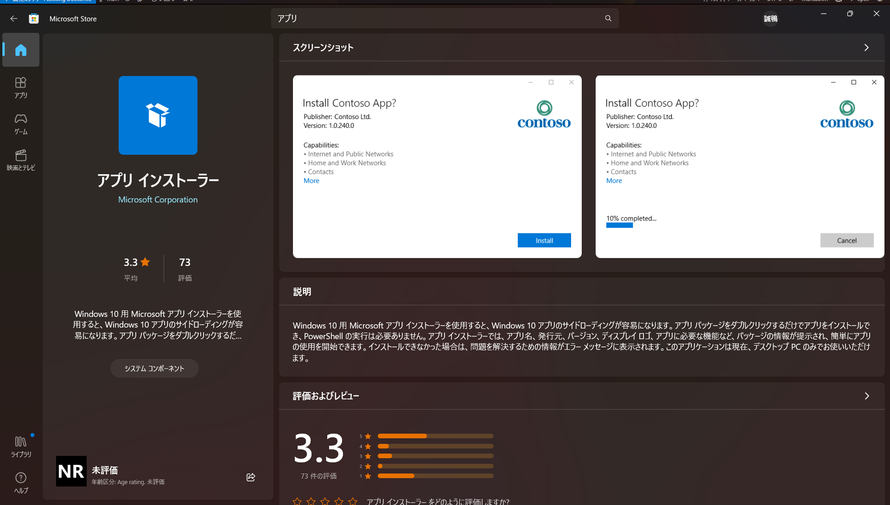
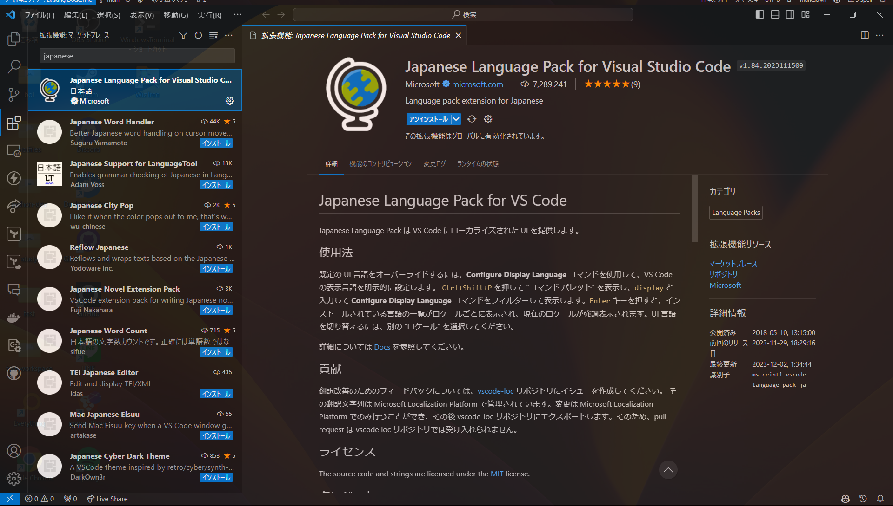
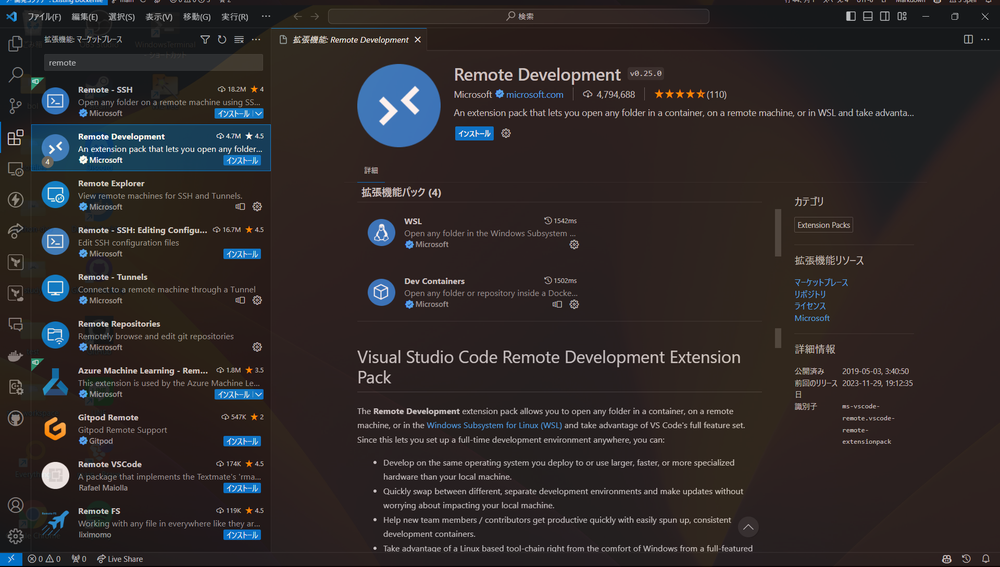

# Windows setup

## 必要ツールインストール

インストールするツールは以下の通りです。

- Docker Desktop
- VSCode
- Git

### 方法1 一括インストール

Microsoft Storeからアプリインストーラをインストールします。

[アプリ インストーラー](https://www.microsoft.com/store/productId/9NBLGGH4NNS1?ocid=pdpshare)



cmd, または PowerShellを起動し、以下のコマンドを実行します。

```bash
winget install --id Docker.DockerDesktop && \
winget install --id Microsoft.VisualStudioCode && \
winget install --id Git.Git
```

### 方法2 個別インストール

それぞれの公式サイトからインストーラをダウンロードし、インストールします。

- [Docker Desktop](https://www.docker.com/products/docker-desktop)
- [VSCode](https://code.visualstudio.com/)
- [Git](https://git-scm.com/download/win) (64bit版をダウンロード)

---

## VSCode設定

### 拡張機能インストール

1. VSCodeを起動します
2. 左側のアイコンから拡張機能を選択します
3. 検索ボックスに`japanese`と入力し、`Japanese Language Pack for Visual Studio Code`をインストールします　
4. 検索ボックスに`remote`と入力し、`Remote - Development`をインストールします　
5. 左下のアカウントアイコンをクリックし、`Sign in to Github`をクリックします
6. Githubアカウントにログインします

## Git設定

### Gitの初期設定

1. Githubアカウントを作成します
    1. Githubアカウントを作成します([Github](https://github.co.jp/))
    2. アカウント名、メールアドレスを覚えておいてください
2. Git Bashを起動します。(cmd, PowerShellでもOK)
3. 以下のコマンドを実行します
    例 : Githubアカウント名が`test`、メールアドレスが`test@gmail.com`の場合

    ```bash
    git config --global user.name test
    git config --global user.email test@gmail.com
    ```

## 開発環境セットアップ

### 方法1 テンプレートを利用する

1. VSCodeを開きます
2. `ctrl + shift + p`を押し、`Git: Clone`を選択します
3. `Githubから複製`を選択します
4. ブラウザが開くので、Githubにサインインします。
5. VSCodeに戻り検索欄に`nitta-lab-polymer/python-dev`と入力し、該当のリポジトリを選択します
6. クローン先のフォルダを選択します
7. VSCodeでクローンしたフォルダを開き、`ctrl + shift + p`でコマンドパレットを開き、`devcontainers: reopen in container`を選択してください。この処理には数分掛かる可能性があります。
8. `project`ディレクトリが作成されるので、その中で開発を行ってください。

※重要

**今後このフォルダを開くときは、`ctrl + shift + p`でコマンドパレットを開き、`devcontainers: reopen in container`を選択してください。**

### 方法2 Devcontainerを手動でセットアップする

1. VSCodeで任意の新しいフォルダを開きます
2. フォルダ内に`Dockerfile`を作成します。内容は[テンプレート](https://github.com/nitta-lab-polymer/python-dev)を参考にしてください
3. `ctrl + shift + p`を押し、`devcontainers: reopen in container`を選択します。
4. `Dockerfileから`を選択します。
5. しばらく待つと開発用コンテナが起動します。
6. 起動後、[こちら](https://github.com/nitta-lab-polymer/dotfiles)のReadmeを参考にして、`.devcontainer`に`dotfiles`の記述を追加します
7. `ctrl + shift + p`を押し、`Rebuild container`を選択します
8. しばらく待つと開発用コンテナが再起動します。

※重要

**今後このフォルダを開くときは、`ctrl + shift + p`でコマンドパレットを開き、`devcontainers: reopen in container`を選択してください。**
